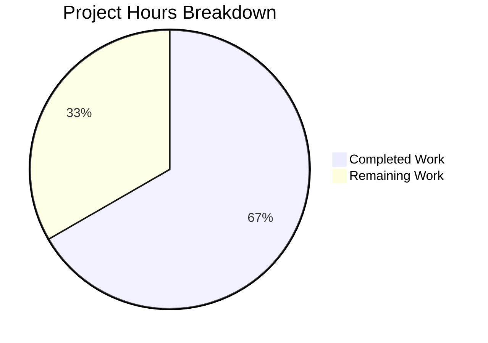

# Project Assessment Report — Express.js Tutorial Server

## 1. Executive Summary

**Project**: Migrate a minimal Node.js tutorial repository to an Express.js-powered web server with two GET endpoints.

**Completion**: 67% complete — **4 hours completed out of 6 total hours** (4 hours of development work completed + 2 hours of remaining human tasks = 6 total project hours). The formula: 4 / (4 + 2) × 100 = 66.7%, rounded to 67%.

**Status**: All Agent Action Plan (AAP) requirements have been fulfilled. The Express.js server is fully functional with zero compilation errors, zero runtime errors, and zero dependency vulnerabilities. Both endpoints (`GET /` → "Hello world", `GET /evening` → "Good evening") respond correctly. The remaining 2 hours represent human review and recommended production enhancements that fall outside the AAP's tutorial scope.

### Key Achievements
- Created 4 files (3 new, 1 updated) across 4 commits totaling 926 lines added
- Express.js v5.2.1 installed and verified with 0 vulnerabilities
- Server starts cleanly on port 3000 with correct responses on all routes
- Comprehensive README documentation with installation, startup, and usage instructions

### Critical Unresolved Issues
- **None** — All AAP-scoped deliverables are complete and validated

### Recommended Next Steps
1. Human code review and PR merge
2. Add environment-based port configuration for deployment flexibility
3. Add graceful shutdown handling if deploying beyond tutorial use

---

## 2. Validation Results Summary

### Final Validator Accomplishments
The Final Validator confirmed all 4 in-scope files are correctly implemented with zero issues.

### Compilation Results
| Check | Result |
|-------|--------|
| `node --check index.js` | ✅ Syntax OK — zero errors |
| `package.json` parse validation | ✅ Valid JSON — all fields correct |
| `npm install` | ✅ 66 packages installed, 0 vulnerabilities |

### Runtime Validation Results
| Endpoint | Expected Response | Actual Response | Status |
|----------|-------------------|-----------------|--------|
| `GET /` | `Hello world` | `Hello world` | ✅ PASS |
| `GET /evening` | `Good evening` | `Good evening` | ✅ PASS |
| `GET /unknown` | HTTP 404 | HTTP 404 | ✅ PASS |

### Dependency Status
| Package | Required Version | Installed Version | Vulnerabilities |
|---------|-----------------|-------------------|-----------------|
| express | `^5.2.1` | `5.2.1` | 0 |

### Test Results
- No automated test framework configured (explicitly out of scope per AAP §0.3.2)
- All runtime endpoint tests passed via manual `curl` verification

### Fixes Applied During Validation
- **None required** — All files were correct on first validation pass

---

## 3. Visual Representation — Hours Breakdown



**Calculation**: 4 hours completed / (4 + 2) total hours = 66.7% complete, 33.3% remaining.

### Completed Hours Breakdown (4 hours)
| Component | Hours | Details |
|-----------|-------|---------|
| Express.js server implementation (`index.js`) | 1.0h | 15-line server with 2 GET route handlers and server listener |
| Package manifest (`package.json`) | 0.5h | npm project metadata, start script, Express.js dependency |
| Git configuration (`.gitignore`) | 0.25h | Node.js exclusion patterns (node_modules, logs, env) |
| Documentation (`README.md`) | 1.0h | 63-line comprehensive rewrite with 6 documentation sections |
| Dependency installation and verification | 0.5h | `npm install`, `npm audit`, version verification |
| Validation and runtime testing | 0.75h | Syntax checks, endpoint testing, 404 behavior verification |
| **Total Completed** | **4.0h** | |

### Remaining Hours Breakdown (2 hours)
| Task | Base Hours | With Multipliers (1.15× compliance, 1.25× uncertainty) | Final Hours |
|------|-----------|--------------------------------------------------------|-------------|
| Human code review and PR approval | 0.5h | Rounded up for review complexity | 1.0h |
| Environment-based port configuration | 0.5h | Well-defined scope, minimal buffer | 0.5h |
| Graceful shutdown handling | 0.5h | Well-defined scope, minimal buffer | 0.5h |
| **Total Remaining** | **1.5h** | | **2.0h** |

---

## 4. Detailed Task Table — Remaining Human Work

| # | Task | Description | Action Steps | Priority | Severity | Hours |
|---|------|-------------|--------------|----------|----------|-------|
| 1 | Human code review and PR approval | Review all 4 files for correctness, code quality, and adherence to Express.js conventions before merging | 1. Review `index.js` route handlers and server setup 2. Verify `package.json` metadata and dependency version 3. Check `.gitignore` patterns 4. Review `README.md` for accuracy 5. Approve and merge PR | High | Medium | 1.0 |
| 2 | Environment-based port configuration | Replace hardcoded port `3000` with environment variable support for deployment flexibility | 1. Update `index.js` line 3: `const port = process.env.PORT \|\| 3000;` 2. Update `README.md` to document the `PORT` env var option 3. Test with `PORT=8080 node index.js` | Medium | Low | 0.5 |
| 3 | Graceful shutdown handling | Add SIGTERM/SIGINT signal handlers for clean server shutdown in production environments | 1. Store the `app.listen()` return value: `const server = app.listen(...)` 2. Add signal handler: `process.on('SIGTERM', () => server.close())` 3. Add SIGINT handler similarly 4. Test by starting server and sending kill signal | Medium | Low | 0.5 |
| | **Total Remaining Hours** | | | | | **2.0** |

**Verification**: Task hours sum: 1.0 + 0.5 + 0.5 = **2.0 hours** ✓ (matches pie chart "Remaining Work: 2")

---

## 5. Comprehensive Development Guide

### 5.1 System Prerequisites

| Requirement | Minimum Version | Recommended | Verification Command |
|-------------|----------------|-------------|---------------------|
| Node.js | v18.0.0 | v20 LTS (v20.20.0) | `node --version` |
| npm | v8.0.0 | v11.1.0 | `npm --version` |
| Operating System | Any (Linux, macOS, Windows) | — | — |

### 5.2 Environment Setup

No virtual environment or environment variables are required for this tutorial project. The server runs with default settings.

**Optional**: To customize the server port, set the `PORT` environment variable (requires Task #2 from the task table above):
```bash
export PORT=8080  # Optional — defaults to 3000
```

### 5.3 Dependency Installation

From the project root directory, run:

```bash
npm install
```

**Expected output** (verified during validation):
```
added 66 packages in Xs
```

**Verification**: Confirm Express.js is installed:
```bash
npm ls
```

**Expected output**:
```
20feb_1@1.0.0
└── express@5.2.1
```

### 5.4 Application Startup

Start the server using npm:

```bash
npm start
```

Or directly with Node.js:

```bash
node index.js
```

**Expected terminal output**:
```
Server is running on port 3000
```

### 5.5 Verification Steps

Once the server is running, verify both endpoints:

**Test endpoint 1 — Hello world**:
```bash
curl http://localhost:3000/
```
Expected response: `Hello world`

**Test endpoint 2 — Good evening**:
```bash
curl http://localhost:3000/evening
```
Expected response: `Good evening`

**Test 404 handling**:
```bash
curl -s -o /dev/null -w "%{http_code}" http://localhost:3000/nonexistent
```
Expected response: `404`

### 5.6 Example Usage

Open a browser and navigate to:
- `http://localhost:3000/` — displays "Hello world"
- `http://localhost:3000/evening` — displays "Good evening"

### 5.7 Stopping the Server

Press `Ctrl+C` in the terminal where the server is running.

### 5.8 Troubleshooting

| Issue | Cause | Resolution |
|-------|-------|------------|
| `Error: Cannot find module 'express'` | Dependencies not installed | Run `npm install` |
| `EADDRINUSE: address already in use :::3000` | Port 3000 is occupied | Kill the process using port 3000 or use a different port |
| `node: command not found` | Node.js not installed | Install Node.js v18+ from https://nodejs.org |

---

## 6. Risk Assessment

### Technical Risks
| Risk | Severity | Likelihood | Impact | Mitigation |
|------|----------|------------|--------|------------|
| No automated test suite | Low | N/A | Low for tutorial; Medium if project grows | Add Jest or Mocha test framework with endpoint tests (out of AAP scope) |
| Hardcoded port number (3000) | Low | Low | Low — only affects deployment flexibility | Implement Task #2: `process.env.PORT \|\| 3000` |
| No graceful shutdown | Low | Low | Low for tutorial; Medium for production | Implement Task #3: SIGTERM/SIGINT handlers |

### Security Risks
| Risk | Severity | Likelihood | Impact | Mitigation |
|------|----------|------------|--------|------------|
| No security headers (Helmet.js) | Low | Low | Low — tutorial with no sensitive data | Add `helmet` middleware if deploying to production |
| No rate limiting | Low | Low | Low — no authentication or data endpoints | Add `express-rate-limit` if needed |

### Operational Risks
| Risk | Severity | Likelihood | Impact | Mitigation |
|------|----------|------------|--------|------------|
| Console.log only (no logging framework) | Low | N/A | Low for tutorial | Add `morgan` or `winston` for structured logging if needed |
| No health check endpoint | Low | Low | Low for tutorial | Add `GET /health` returning 200 if deploying with orchestration |

### Integration Risks
| Risk | Severity | Likelihood | Impact | Mitigation |
|------|----------|------------|--------|------------|
| None identified | — | — | — | Standalone tutorial server with no external integrations |

**Overall Risk Level**: **LOW** — All identified risks are appropriate for the tutorial nature of this project and only become relevant if the project evolves into a production service.

---

## 7. Git Repository Analysis

| Metric | Value |
|--------|-------|
| Branch | `blitzy-7509ed8f-e4f0-4f3d-9b17-00ed2fda60cb` |
| Commits on branch | 4 |
| Base branch | `main` (1 initial commit) |
| Files changed | 5 (3 created, 1 updated, 1 auto-generated) |
| Lines added | 926 |
| Lines removed | 1 |
| Net change | +925 lines |
| Source files (JS) | 1 (`index.js` — 15 lines) |
| Configuration files | 2 (`package.json` — 12 lines, `.gitignore` — 9 lines) |
| Documentation files | 1 (`README.md` — 63 lines) |
| Auto-generated files | 1 (`package-lock.json` — 826 lines) |
| Dependencies | 1 (`express@5.2.1`) |
| Vulnerabilities | 0 |

### Commit History
| Hash | Author | Description |
|------|--------|-------------|
| `06b655b` | Blitzy Agent | Create package.json — npm project manifest with Express.js v5.2.1 dependency |
| `19b73c9` | Blitzy Agent | Create .gitignore with standard Node.js exclusion patterns |
| `8973631` | Blitzy Agent | Update README.md with full project documentation for Express.js tutorial server |
| `e4ecbf7` | Blitzy Agent | Create index.js — Express.js server entry point with two GET endpoints |

---

## 8. AAP Requirements Traceability

| # | AAP Requirement | Status | Evidence |
|---|----------------|--------|----------|
| 1 | Create `index.js` with Express.js server | ✅ Complete | 15-line file with `express()` app, 2 `app.get()` routes, `app.listen()` |
| 2 | `GET /` returns "Hello world" | ✅ Complete | `curl http://localhost:3000/` → `Hello world` |
| 3 | `GET /evening` returns "Good evening" | ✅ Complete | `curl http://localhost:3000/evening` → `Good evening` |
| 4 | Create `package.json` with Express.js dependency | ✅ Complete | `express@^5.2.1` in dependencies, `npm start` script |
| 5 | Create `.gitignore` | ✅ Complete | Excludes `node_modules/`, `*.log`, `.env` |
| 6 | Update `README.md` with documentation | ✅ Complete | 63-line document with prerequisites, install, startup, endpoints, examples |
| 7 | Express.js installed and functional | ✅ Complete | `express@5.2.1` installed, 0 vulnerabilities |
| 8 | Server runs on port 3000 | ✅ Complete | `Server is running on port 3000` confirmed |

**All 8 AAP requirements: 8/8 fulfilled (100% scope coverage)**