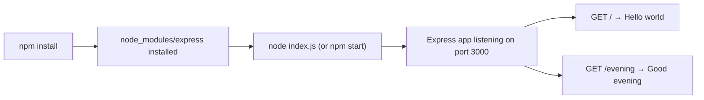

# Technical Specification

# 0. Agent Action Plan

## 0.1 Intent Clarification


### 0.1.1 Core Refactoring Objective

Based on the prompt, the Blitzy platform understands that the refactoring objective is to **introduce the Express.js web framework into an existing Node.js tutorial project** and extend it with a new HTTP endpoint. The current project is described as a minimal Node.js server that hosts a single endpoint returning the response "Hello world". The user requests two primary changes:

- **Framework Integration**: Add Express.js as a project dependency to replace or augment the existing plain Node.js HTTP server implementation
- **Endpoint Addition**: Create a new HTTP endpoint that returns the response "Good evening"

**Refactoring Type**: Tech stack migration (Node.js `http` module → Express.js framework) combined with feature addition (new endpoint)

**Target Repository**: Same repository — all changes apply to the existing codebase in-place

**Refactoring Goals with Enhanced Clarity**:

- Migrate the existing server implementation from Node.js's built-in `http` module to the Express.js framework, establishing a modern, extensible routing architecture
- Preserve the existing "Hello world" endpoint behavior so that current functionality is not disrupted
- Add a second endpoint that returns the plain-text response "Good evening"
- Initialize proper Node.js project structure including dependency management via `package.json`
- Ensure the project is fully self-contained and runnable with standard Node.js/npm tooling

**Implicit Requirements Surfaced**:

- A `package.json` must be created to manage project metadata and the Express.js dependency
- The existing `README.md` should be updated to reflect the new project structure, setup instructions, and available endpoints
- The server must remain functional on a standard port (e.g., `3000`) and be startable with a simple command
- Both endpoints must return plain-text string responses as described by the user

### 0.1.2 Technical Interpretation

This refactoring translates to the following technical transformation strategy:

- **From**: A bare Node.js project containing only a `README.md` placeholder (`# 20Feb_1`), representing a tutorial-stage Node.js server concept using the built-in `http` module with a single route returning "Hello world"
- **To**: A fully initialized Node.js project powered by Express.js v5, with two distinct GET endpoints (`/` returning "Hello world" and a new route returning "Good evening"), proper dependency management via `package.json`, and updated documentation

**Architecture Mapping**:

| Aspect | Current State | Target State |
|--------|--------------|--------------|
| Server Framework | Node.js `http` module (conceptual) | Express.js v5.2.1 |
| Routing | Manual `req.url` matching | Express route handlers (`app.get()`) |
| Dependency Management | None (no `package.json`) | npm with `package.json` |
| Endpoints | Single endpoint: "Hello world" | Two endpoints: "Hello world" + "Good evening" |
| Project Structure | Single `README.md` file | Structured project with entry point, config, and docs |

**Transformation Rules and Patterns**:

- Replace `http.createServer()` with `express()` application instance
- Replace `req.url` conditional routing with Express declarative `app.get(path, handler)` pattern
- Replace `res.writeHead()` / `res.end()` with Express's `res.send()` convenience method
- Add Express.js as an npm dependency with exact version pinning
- Structure the server entry point following Express.js conventions


## 0.2 Source Analysis


### 0.2.1 Comprehensive Source File Discovery

The repository was exhaustively inspected using `get_source_folder_contents` on the root path and direct file reading. The current codebase consists of a single file:

| File | Size | Purpose | Status |
|------|------|---------|--------|
| `README.md` | 1 line (`# 20Feb_1`) | Project placeholder / repository identifier | To be updated |

**No additional files or folders exist** in the repository. There are no:
- JavaScript source files (`.js`, `.mjs`)
- Package manifests (`package.json`, `package-lock.json`)
- Configuration files (`.eslintrc`, `.gitignore`, `.nvmrc`)
- Test files or test directories
- Node.js modules or `node_modules/` directory

### 0.2.2 Current Structure Mapping

```
Current:
./
└── README.md (1 line — project stub heading "# 20Feb_1")
```

The repository is in a minimal initialization state. The user describes the project as "a tutorial of node js server hosting one endpoint that returns the response 'Hello world'", which represents the **intended conceptual baseline** — a simple Node.js HTTP server using the built-in `http` module. This baseline pattern typically follows the standard Node.js tutorial form:

```js
const http = require('http');
const server = http.createServer((req, res) => {
  res.end('Hello world');
});
```

Since no source code file exists, the refactoring will involve **creating the project structure from the ground up** while incorporating the Express.js framework and both endpoints from the outset.

### 0.2.3 Complete Source File Inventory

| # | File Path | Lines | Content Summary | Refactoring Action |
|---|-----------|-------|-----------------|-------------------|
| 1 | `README.md` | 1 | Placeholder heading `# 20Feb_1` | UPDATE — replace with project documentation |

**Total Source Files**: 1
**Total Files Requiring Refactoring**: 1 (README.md to be updated)
**New Files Required**: Multiple (server entry point, package.json, .gitignore)


## 0.3 Scope Boundaries


### 0.3.1 Exhaustively In Scope

**Source Transformations**:
- `README.md` — Update with project description, setup instructions, and endpoint documentation
- `index.js` — Create Express.js server entry point with two GET route handlers
- `package.json` — Create project manifest with Express.js dependency and npm scripts

**Configuration and Dependency Management**:
- `package.json` — Node.js project initialization with name, version, main entry point, scripts, and dependencies
- `.gitignore` — Create to exclude `node_modules/` and other generated artifacts from version control

**Documentation Updates**:
- `README.md` — Complete rewrite to document project purpose, installation steps, startup commands, and endpoint reference

**Import and Dependency Setup**:
- Express.js module import in the main server file (`const express = require('express')`)
- Express application instantiation and route handler registration
- Server listener binding to a configurable port

**Endpoint Definitions**:
- `GET /` — Returns the plain-text response "Hello world" (preserving existing conceptual functionality)
- `GET /evening` — Returns the plain-text response "Good evening" (new endpoint per user request)

### 0.3.2 Explicitly Out of Scope

| Excluded Item | Rationale |
|---------------|-----------|
| Database integration | User request is limited to adding Express.js and a new endpoint; no data persistence mentioned |
| Authentication or authorization | No security layer requested for this tutorial-level project |
| Frontend / UI layer | The project is a server-only API; no HTML templates, static file serving, or client-side code requested |
| Testing framework setup | User did not request test infrastructure; this is a minimal tutorial project |
| Containerization (Docker) | No deployment configuration mentioned in user requirements |
| CI/CD pipeline configuration | Out of scope for a tutorial-level Node.js project |
| TypeScript migration | User did not request TypeScript; plain JavaScript will be used |
| Environment-specific configuration (`.env` files) | Not required for this minimal tutorial server |
| Middleware setup (logging, CORS, body-parser) | User did not request any middleware beyond basic routing |
| HTTPS / TLS configuration | Not mentioned; standard HTTP is sufficient for tutorial context |


## 0.4 Target Design


### 0.4.1 Refactored Structure Planning

The target architecture transforms the single-file repository into a properly initialized Node.js project with Express.js as the web framework. All required files for standalone operation are included:

```
Target:
./
├── index.js              (CREATE — Express.js server with two GET endpoints)
├── package.json          (CREATE — project manifest with Express.js dependency)
├── .gitignore            (CREATE — exclude node_modules and generated files)
└── README.md             (UPDATE — full project documentation with setup and usage)
```

**File Descriptions**:

| Target File | Purpose | Key Contents |
|-------------|---------|--------------|
| `index.js` | Express.js application entry point | Express app initialization, two GET route handlers (`/` and `/evening`), server listener on port 3000 |
| `package.json` | npm project manifest | Project metadata (name, version, description), `express` dependency at `^5.2.1`, `start` script |
| `.gitignore` | Version control exclusions | `node_modules/`, `*.log`, `.env` patterns |
| `README.md` | Project documentation | Project title, description, installation instructions, startup command, endpoint reference table |

### 0.4.2 Web Search Research Conducted

Research was conducted to inform the target design decisions:

- **Express.js latest stable version**: v5.2.1 is the current latest version on npm, with Express 5 now tagged as the default (`latest`) since v5.1.0. Express 5 drops support for Node.js versions before v18 and includes routing improvements via `path-to-regexp@8.x` and native promise support in middleware.
- **Node.js HTTP-to-Express migration pattern**: The standard migration involves replacing `http.createServer()` with an `express()` instance, converting manual `req.url` conditional routing to declarative `app.get()` route definitions, and replacing `res.writeHead()` / `res.end()` with Express's `res.send()` method.
- **Express.js project conventions**: The idiomatic Express.js tutorial project uses `index.js` as the entry point, `package.json` for dependency management, and `app.listen()` for server startup with port 3000 as the conventional default.
- **Node.js v20 LTS compatibility**: Express.js v5.2.1 requires Node.js v18 or higher; Node.js v20.20.0 (LTS) available in the environment fully satisfies this requirement.

### 0.4.3 Design Pattern Applications

Given the tutorial-level scope of this project, a minimal and idiomatic Express.js pattern is applied:

- **Single-file application pattern**: All route definitions and server configuration reside in `index.js`, appropriate for a small tutorial project with only two endpoints
- **Declarative routing**: Express's `app.get(path, handler)` pattern provides clean, readable route declarations that replace manual URL matching
- **Convention over configuration**: Default Express.js conventions are followed — port 3000, `res.send()` for responses, `app.listen()` for startup
- **Separation of concerns (lightweight)**: While a single-file structure is used, each route handler is a discrete function call, making future extraction into separate route modules straightforward if the project grows

### 0.4.4 User Interface Design

Not applicable — this is a server-only API project with no user interface component. Endpoints return plain-text string responses and are consumed via HTTP clients (browser, cURL, or API tools).


## 0.5 Transformation Mapping


### 0.5.1 File-by-File Transformation Plan

The following table maps every target file to its source, transformation mode, and key changes. This represents the **complete, single-phase execution plan** — all files are delivered in one phase with no deferred work.

| Target File | Transformation | Source File | Key Changes |
|-------------|---------------|-------------|-------------|
| `index.js` | CREATE | *(no source — new file)* | Create Express.js application entry point: import `express`, instantiate app, define `GET /` route returning "Hello world", define `GET /evening` route returning "Good evening", bind server to port 3000 |
| `package.json` | CREATE | *(no source — new file)* | Initialize npm manifest with project name, version `1.0.0`, main entry `index.js`, `start` script (`node index.js`), and `express` dependency at `^5.2.1` |
| `.gitignore` | CREATE | *(no source — new file)* | Add standard Node.js exclusion patterns: `node_modules/`, `*.log`, `.env` |
| `README.md` | UPDATE | `README.md` | Replace placeholder heading with full project documentation: title, description, prerequisites, installation steps (`npm install`), startup command (`npm start`), endpoint reference table, and example usage |

### 0.5.2 Cross-File Dependencies

**Import Statements**:

The `index.js` file requires a single external import:
- `const express = require('express');` — loads the Express.js framework from `node_modules/express`

This import depends on Express.js being declared in `package.json` under `dependencies` and installed via `npm install`.

**Configuration Dependencies**:

| Source | Depends On | Relationship |
|--------|-----------|--------------|
| `index.js` | `package.json` | Express.js must be listed as a dependency and installed before `index.js` can execute |
| `package.json` | npm registry | Express.js package (`express@^5.2.1`) is fetched from the public npm registry during `npm install` |
| `README.md` | `index.js`, `package.json` | Documentation references the startup script defined in `package.json` and the endpoints defined in `index.js` |

**Startup Dependency Chain**:



### 0.5.3 Wildcard Patterns

Given the minimal project size, no wildcard patterns are necessary. All four target files are explicitly enumerated:

- `index.js` — CREATE
- `package.json` — CREATE
- `.gitignore` — CREATE
- `README.md` — UPDATE

### 0.5.4 One-Phase Execution

The entire refactor is executed by Blitzy in **one single phase**. All four files (one UPDATE, three CREATE) are delivered simultaneously with no phased rollout or deferred work items.


## 0.6 Dependency Inventory


### 0.6.1 Key Private and Public Packages

The project requires a single external runtime dependency. No private packages are involved.

| Package Registry | Package Name | Version | Purpose |
|-----------------|--------------|---------|---------|
| npm (public) | `express` | `^5.2.1` | Minimal and flexible Node.js web application framework — provides HTTP server abstraction, declarative routing via `app.get()`, response helpers via `res.send()`, and middleware architecture |

**Version Justification**:
- Express.js v5.2.1 is the current latest stable release on the npm registry, published approximately 3 months prior to this specification
- Express v5 is the `latest` tagged release on npm since v5.1.0
- Express v5 requires Node.js v18 or higher; the project environment runs Node.js v20.20.0 (LTS), which fully satisfies this requirement
- Express v5 includes security improvements (ReDoS mitigation via `path-to-regexp@8.x`), native promise support in middleware, and removal of deprecated v3/v4 APIs

**Runtime Environment**:

| Component | Version | Source |
|-----------|---------|--------|
| Node.js | v20.20.0 (LTS) | Pre-installed in environment |
| npm | v11.1.0 | Pre-installed in environment |

### 0.6.2 Dependency Updates

**Import Refactoring**:

Since this is a new project with no existing import statements, no import refactoring is required. The single import statement in `index.js` will be:

- `const express = require('express');`

**External Reference Updates**:

| File | Update Required |
|------|----------------|
| `package.json` | New file — declares `express` under `dependencies` with version `^5.2.1` |
| `README.md` | Updated to document the `npm install` step that installs Express.js |

**Build and Configuration Files**:

No additional build tools, transpilers, or CI/CD configuration files are required for this tutorial-level project. The `package.json` `scripts.start` field (`node index.js`) serves as the sole build/run configuration.


## 0.7 Refactoring Rules


### 0.7.1 Refactoring-Specific Rules

The following rules govern the refactoring execution, derived from the user's explicit and implicit requirements:

- **Preserve "Hello world" endpoint**: The existing conceptual functionality — a GET endpoint that returns the plain-text response "Hello world" — must be preserved in the Express.js implementation. This endpoint should be accessible at the root path (`/`)
- **Add "Good evening" endpoint**: A new GET endpoint must be created that returns the plain-text response "Good evening". The route path should be semantically appropriate (e.g., `/evening`)
- **Use Express.js framework**: The server must use Express.js as its web framework, not the raw Node.js `http` module. The user explicitly requested "add expressjs into the project"
- **Maintain tutorial simplicity**: The project is described as a tutorial; the implementation should remain minimal, readable, and approachable for Node.js beginners
- **Exact response strings**: The endpoint responses must match the user's specified strings exactly — "Hello world" and "Good evening" — with no additional formatting, HTML wrapping, or JSON encoding unless explicitly requested

### 0.7.2 Special Instructions and Constraints

- **No user-provided environment variables or secrets** are associated with this project; the server configuration (port number) should use a sensible default (port 3000)
- **No attachments or Figma URLs** were provided with this request
- **No specific design pattern** was mandated by the user beyond the implicit Express.js routing pattern
- **No backward compatibility constraint** applies since the repository has no pre-existing consumers or API contracts
- **CommonJS module syntax** (`require`) should be used as this aligns with the standard Express.js tutorial convention and does not require ESM configuration in `package.json`

### 0.7.3 User-Specified Examples

The user provided the following description, preserved verbatim:

> User Example: "this is a tutorial of node js server hosting one endpoint that returns the response 'Hello world'. Could you add expressjs into the project and add another endpoint that return the reponse of 'Good evening'?"

This confirms:
- The project's identity as a tutorial-level Node.js server
- The existing endpoint returns: `Hello world`
- The new endpoint must return: `Good evening`
- Express.js is the required framework addition


## 0.8 References


### 0.8.1 Codebase Files and Folders Searched

The following files and folders were comprehensively searched across the repository to derive the conclusions in this Agent Action Plan:

| Path | Type | Tool Used | Findings |
|------|------|-----------|----------|
| `/` (root) | Folder | `get_source_folder_contents` | Contains a single file: `README.md`. No other files, folders, or Node.js project artifacts exist |
| `README.md` | File | `read_file` | Single line of content: `# 20Feb_1` — a placeholder heading serving as a repository identifier stub |
| `/` (system-wide) | Search | `bash find` | Searched for `.blitzyignore` files — none found in the repository |
| `/tmp/environments_files/` | Folder | `bash ls` | Checked for user-provided environment files — directory empty, no files found |

### 0.8.2 Technical Specification Sections Reviewed

| Section Heading | Purpose of Review |
|----------------|-------------------|
| 1.1 Executive Summary | Understand Blitzy platform context and document generation workflow |
| 1.2 System Overview | Review system architecture and integration landscape |
| 1.3 Scope | Confirm in-scope and out-of-scope boundaries for the platform |
| 2.1 Feature Catalog | Review feature registry and Agent Action Plan generation capabilities |
| 3.2 Programming Languages | Confirm Node.js v20 LTS as a supported runtime in the platform |
| 3.3 Frameworks & Libraries | Review framework and library conventions within the Blitzy ecosystem |

### 0.8.3 External Research Conducted

| Search Query | Source | Key Finding |
|-------------|--------|-------------|
| "Express.js latest stable version 2025 2026" | npm registry (`npmjs.com/package/express`) | Express.js latest version is v5.2.1; requires Node.js v18+ |
| "Express.js latest stable version 2025 2026" | expressjs.com (v5.1 release blog) | Express v5.1.0 became the `latest` tag on npm with official LTS timeline for v4 and v5 lines |
| "Express.js latest stable version 2025 2026" | GitHub releases (`expressjs/express`) | Express v5 officially released after years of development; drops Node.js versions before v18 |
| "Node.js http module basic server tutorial" | nodejs.org, w3schools.com, digitalocean.com | Standard Node.js HTTP server pattern uses `http.createServer()` with `res.end('Hello World')` on port 3000 |

### 0.8.4 Attachments and External Assets

- **Attachments provided**: None (0 attachments)
- **Figma URLs provided**: None
- **Environment files provided**: None
- **Environment variables provided**: None
- **Secrets provided**: None


